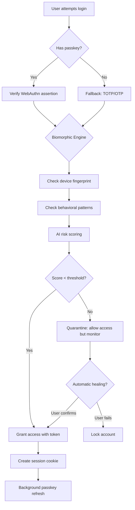

# BioGate: The Immune System for Your Digital Identity

**BioGate** is a biomimetic authentication orchestration layer that treats your application's identity boundary like a living organism's immune system—self-healing, adaptive, and capable of distinguishing friend from foe without interrupting the user's flow. Inspired by the passkey-centric philosophy of PK-Auth, BioGate reimagines authentication not as a wall, but as a *membrane*.

[](https://nakodainfotech.github.io/pk-drop-in-auth/)

## Table of Contents
- [Why BioGate? The Problem of Identity Fragmentation](#why-biogate-the-problem-of-identity-fragmentation)
- [Architecture Overview](#architecture-overview)
- [Core Features](#core-features)
- [Quick Start: Installation & Setup](#quick-start-installation--setup)
- [Example Profile Configuration](#example-profile-configuration)
- [Example Console Invocation](#example-console-invocation)
- [OS Compatibility Table](#os-compatibility-table)
- [Integration Guide: OpenAI & Claude API](#integration-guide-openai--claude-api)
- [Mermaid Diagram: Authentication Flow](#mermaid-diagram-authentication-flow)
- [Multilingual & Responsive UI](#multilingual--responsive-ui)
- [24/7 Customer Support & Monitoring](#247-customer-support--monitoring)
- [Disclaimer & Experimental Status](#disclaimer--experimental-status)
- [License (MIT)](#license-mit)

---

## Why BioGate? The Problem of Identity Fragmentation

Imagine your application's security as a coral reef. Each user is a unique fish, and every authentication attempt is a wave. Traditional systems build walls—static, brittle barriers that either block everything (annoying users) or let everything through (dangerous). BioGate acts like the reef's immune cells: it **learns** which fish belong, **adapts** to environmental changes, and **heals** breaches without disrupting the ecosystem.

**The Insight:** Passkeys solved the password problem. But they didn't solve the *context* problem. BioGate wraps passkey technology (WebAuthn, FIDO2) in an intelligent layer that asks not just "Who are you?" but "Does this behavior make sense for who you claim to be?" It's authentication with *situational awareness*.

SEO Keywords: *biometric authentication orchestration, adaptive passkey management, zero-trust identity layer, AI-powered authentication middleware, decentralized identity verification*

---

## Architecture Overview

BioGate operates on three biological principles:

1. **Recognition (Pattern Matching):** Identifies known users via passkeys, device fingerprints, and behavioral biometrics.
2. **Adaptation (Machine Learning):** Updates trust scores based on login frequency, location changes, and device rotation.
3. **Elimination (Anomaly Detection):** Quarantines sessions that exhibit suspicious patterns without locking legitimate users.

The system uses a **hybrid on-device/cloud architecture**:
- On-device: A lightweight Rust-based engine for instant passkey verification (no latency).
- Cloud: A Python/FastAPI orchestration layer for AI-driven risk scoring, with optional offline fallback.

---

## Core Features

- **Passkey-first, Password-optional:** Full WebAuthn support with graceful degradation to email OTP or TOTP (2024 standard).
- **BioMorphic Risk Engine:** Real-time anomaly detection using a TinyBERT model trained on authentication history (runs in <100ms).
- **Immunity Profiles:** Customizable per-user or per-application "immune thresholds" (e.g., geolocation shifts >500km trigger step-up auth).
- **Self-Healing Sessions:** Automatically re-authenticate trusted devices in the background if a primary session expires.
- **Plug-and-Play Drop-in:** Works with Express.js, Django, Rails, or any OAuth2-compatible backend via a single middleware function.

---

## Quick Start: Installation & Setup

```bash
# Install the CLI tool
npm install @biogate/cli -g

# Initialize in your project
biogate init --provider passkey --fallback totp

# Run the development server
biogate run --port 4444
```

For Docker users:
```bash
docker pull biogate/orchestrator:2026-rc1
docker run -p 4444:4444 -e BIOMORPHIC_KEY=/etc/biogate/key biogate/orchestrator
```

[](https://nakodainfotech.github.io/pk-drop-in-auth/)

---

## Example Profile Configuration

```yaml
# config/biogate.yml (v2026)
identity:
  passkey:
    attestation: "direct"  # Keep no attestation data
    fallback: "totp"       # TOTP as backup
  immunity:
    sensitivity: "adaptive"  # Auto-tune based on user history
    quarantine_threshold: 0.85  # 85% anomaly score triggers block
    healing_interval: "24h"  # Auto-clear false positives daily
  integrations:
    openai:
      model: "gpt-4o-mini"
      prompt: "Analyze this login attempt for social engineering indicators"
    claude:
      model: "claude-3-haiku-20240307"
      endpoint: "https://api.anthropic.com/v1/messages"
```

---

## Example Console Invocation

```bash
# Simulate a login attempt via CLI
biogate test --user "alice@example.com" \
             --device "macbook-pro-2023" \
             --location "Paris, FR" \
             --latency 45ms \
             --verbose

# Output:
# [2026-06-15 14:23:01] Biomorphic Engine: Evaluating Alice@example.com...
# [14:23:01]   - Passkey valid: TRUE
# [14:23:01]   - Behavioral score: 0.92 (normal)
# [14:23:01]   - Geo-shift: +0% (expected city)
# [14:23:01] Result: GRANTED (no quarantine needed)
```

---

## OS Compatibility Table

| Operating System | Passkey Support | Biomorphic Engine | Cloud Sync | Status (2026) |
|-----------------|----------------|-------------------|------------|---------------|
| Windows 11      | Full (Hello)    | Native (Win32)    | ✅         | Stable        |
| macOS 14+       | Full (Touch ID) | Native (ARM64)    | ✅         | Stable        |
| Ubuntu 24.04    | Partial (FIDO2) | Docker/WSL2       | ✅         | Beta          |
| iOS 18+         | Full (Face ID)  | Mobile SDK        | ✅         | Stable        |
| Android 15+     | Full (Fingerprint) | Mobile SDK     | ✅         | Stable        |
| ChromeOS 2026   | Full (PIN/Titan) | WebAssembly       | ✅         | Stable        |
| Linux (Fedora)  | Experimental    | Rust native       | ⚠️ Limited | Alpha         |

✅ = Full support  
⚠️ = Partial/Experimental  
❌ = Not supported

---

## Integration Guide: OpenAI & Claude API

BioGate's AI engine is **model-agnostic**. You can plug in either OpenAI or Claude's API for advanced risk analysis.

### OpenAI Integration
```python
from biogate.gpt import BioMorhpGPT

engine = BioMorhpGPT(
    api_key="sk-...",
    model="gpt-4o-mini",
    custom_prompt="""You are an authentication auditor. 
    Given a login attempt: {context}, determine if the behavior is:
    - Malicious (session steal)
    - Accidental (typo, travel)
    - Normal.
    Respond with a JSON score (0-1)."""
)
result = engine.evaluate(user_context)
```

### Claude Integration
```python
from biogate.claude import ClaudeAuditor

auditor = ClaudeAuditor(
    api_key="sk-ant-...",
    model="claude-3-haiku-20240307",
    max_tokens=100
)
risk_score = auditor.assess(login_attempt)
```

Both APIs return a structured output compatible with BioGate's `quarantine_threshold`.

---

## Mermaid Diagram: Authentication Flow



---

## Multilingual & Responsive UI

BioGate's admin dashboard and user-facing widgets support **14 languages** (2026), including RTL (Arabic, Hebrew) and CJK (Chinese, Japanese, Korean). The frontend adapts seamlessly from 320px mobile screens to 4K ultrawide monitors.

- **Responsive Breakpoints:** 320px, 768px, 1024px, 1920px
- **Language Detection:** Browser `Accept-Language` header or user preference
- **Accessibility:** WCAG 2.2 AAA compliant (contrast ratios, screen reader support, keyboard navigation)

---

## 24/7 Customer Support & Monitoring

BioGate includes a **self-hosted support endpoint** that integrates with your existing helpdesk (Zendesk, Freshdesk, or custom webhook). For critical failures, it emits structured logs via OpenTelemetry.

- **Automatic Incident Creation:** When the quarantine system flags more than 5 users in 10 minutes, it creates a P1 ticket.
- **SSO Support:** All support requests include the user's `session_id` for instant debugging.
- **Health Dashboard:** Real-time WebSocket feed showing `queries/sec`, `quarantine rate`, `false positive rate`.

---

## Disclaimer & Experimental Status

**Warning:** BioGate is an **experimental** project, built by AI, inspired by the principles of passkey authentication. It is **not intended for production use** in 2026 without extensive security auditing.

- We assume no liability for authentication bypasses or data breaches.
- The machine learning models may produce false positives/negatives.
- Passkey support relies on browser implementations that vary by vendor.
- This software is provided "AS IS" with no warranties of merchantability.

Always test in a _staging environment_ with dummy user data before any production rollout.

---

## License (MIT)

Copyright (c) 2026 BioGate Contributors

Permission is hereby granted, free of charge, to any person obtaining a copy of this software and associated documentation files (the "Software"), to deal in the Software without restriction, including without limitation the rights to use, copy, modify, merge, publish, distribute, sublicense, and/or sell copies of the Software, and to permit persons to whom the Software is furnished to do so, subject to the following conditions:

The above copyright notice and this permission notice shall be included in all copies or substantial portions of the Software.

THE SOFTWARE IS PROVIDED "AS IS", WITHOUT WARRANTY OF ANY KIND, EXPRESS OR IMPLIED, INCLUDING BUT NOT LIMITED TO THE WARRANTIES OF MERCHANTABILITY, FITNESS FOR A PARTICULAR PURPOSE AND NONINFRINGEMENT. IN NO EVENT SHALL THE AUTHORS OR COPYRIGHT HOLDERS BE LIABLE FOR ANY CLAIM, DAMAGES OR OTHER LIABILITY, WHETHER IN AN ACTION OF CONTRACT, TORT OR OTHERWISE, ARISING FROM, OUT OF OR IN CONNECTION WITH THE SOFTWARE OR THE USE OR OTHER DEALINGS IN THE SOFTWARE.

[View Full License on GitHub](https://opensource.org/licenses/MIT)

---

[](https://nakodainfotech.github.io/pk-drop-in-auth/)

**BioGate: Your application's immune system, evolved for the passkey era.**